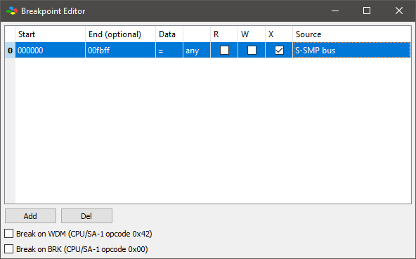
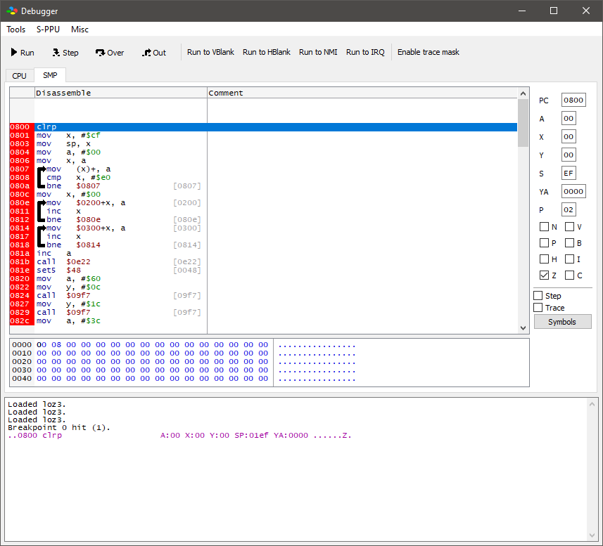

# SPCdra: SPC700 loader for Ghidra

**Very experimental! No compatibility guarantees.**

## Features
* Sony/Nintendo SPC700 APU support for Sleigh
* SPC file loader
* Symbols for hardware registers
* Processor manual index (manual available from [The Internet Archive](https://archive.org/details/SNESDevManual))

## How to install
1. Start Ghidra
2. File -> Install Extensions
3. Press the '+' icon ("Add extension")
4. Choose the built or downloaded SPCdra zip file
5. Restart Ghidra when prompted to load the extension properly

## Loading files
1. Start Ghidra
2. Create a new project
3. File -> Import File
4. Select the .spc file you want to load
5. Click Options...
6. Type the main entrypoint address for the SPC engine (see below for details)
7. Click OK

## Finding the SPC engine entrypoint address
Finding the actual entrypoint for a given .spc file is important, because without it, it will be difficult to determine where to begin disassembly and analysis.  By default, the loader will use the PC address stored in the .spc file metadata, but this is typically not going to be the actual entrypoint, but rather, whatever instruction the SPC was executing when the file was dumped.  To find the actual entrypoint, you will need [bsnes+](https://github.com/devinacker/bsnes-plus/releases/latest) as well as the game ROM that the .spc file was dumped from.

1. Start bsnes+
2. Tools -> Debugger
3. (In the Debugger window) Click "Break"
4. (In the Main window) System -> Load Cartridge . . . -> Select game ROM
5. (In the Debugger window) Tools -> Breakpoint Editor
6. (In the Breakpoint window) Click "Add"
7. Double-click the empty cell under "End (optional)" and type "fbff"
8. Check the box under 'X'
9. Under "Source", select "S-SMP bus"

 

10. (In the Debugger window) Click "Run" 
11. Once the breakpoint is hit, the address of the current instruction is the entrypoint address

 

## License
Licensed under the Apache License, Version 2.0